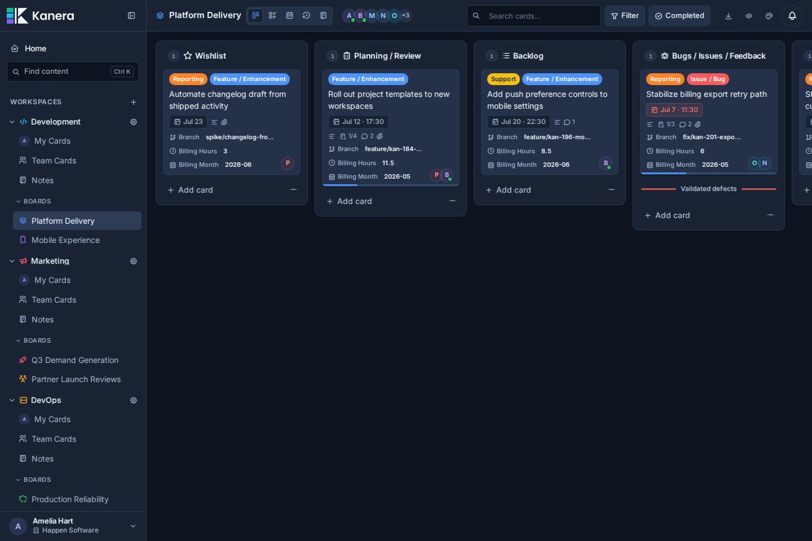
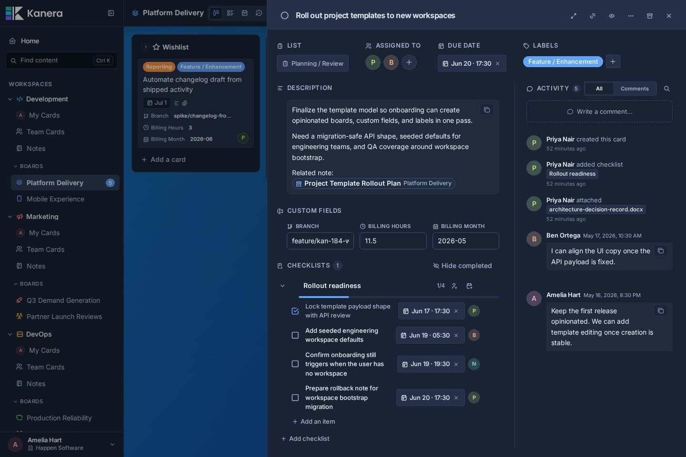
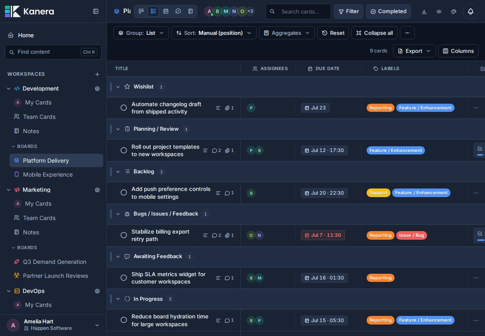
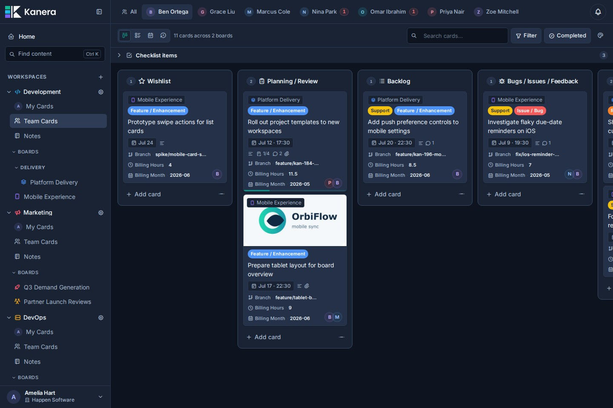
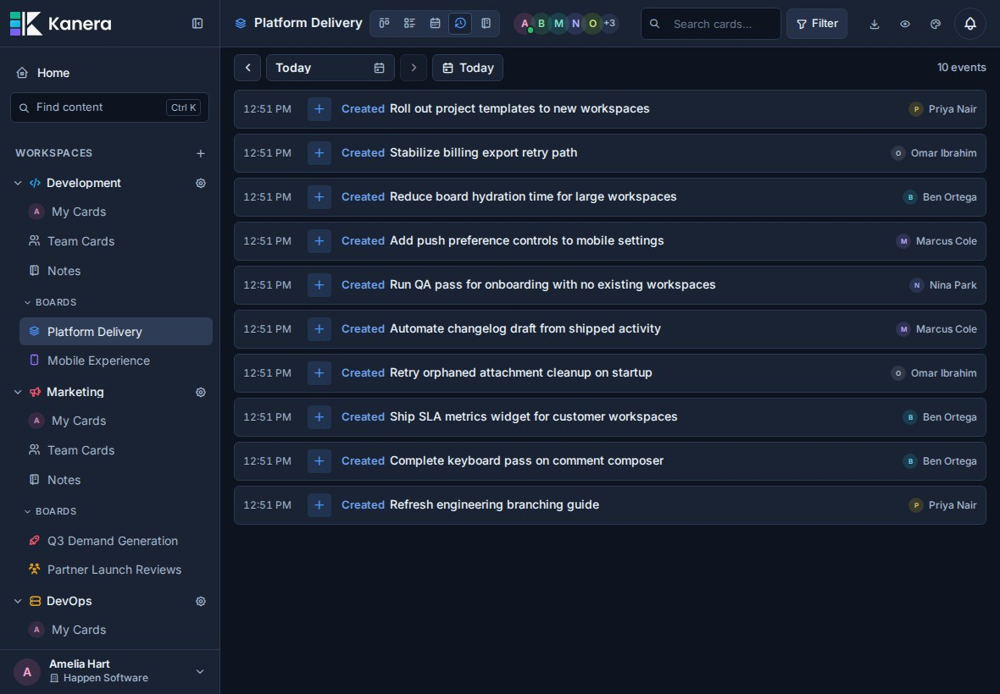

<div align="center">

# Kanera

**One clear view. Keep work moving.**

See what is assigned, what changed, what is blocked, and what has been completed across every project, client, and team.

[Start free](https://board.kanera.app/signup) · [Explore features](https://www.kanera.app/features) · [Read the docs](https://www.kanera.app/docs) · [Self-host Kanera](https://www.kanera.app/docs/self-host)

</div>



Kanera coordinates assigned, active, blocked, and completed work across projects, clients, and teams from one fast, polished workspace. It brings boards, structured tasks, notes, assignments, progress history, automation, and integrations into one focused system—more visibility than a basic Kanban board without the overhead of a heavyweight work suite.

Use the hosted service and get started in minutes, or self-host Kanera on your own infrastructure.

## One place for moving work forward

- **Plan in the view that fits.** Move between Kanban, List, Calendar, Assigned Work, and Work Done without duplicating work.
- **Keep the details with the task.** Add descriptions, comments, attachments, labels, custom fields, watchers, and assignable checklist items to cards.
- **See what needs attention.** Bring work assigned to you or your team together across every board, with search and filters when you need to narrow the view.
- **Make progress visible.** Review what was created, moved, completed, or checked off without chasing another status update.
- **Keep knowledge nearby.** Use personal, workspace, and board notes for decisions, processes, references, and project context.
- **Automate and integrate.** Handle repetitive updates with trigger-based automations, or connect other tools through the REST API, webhooks, and MCP server.
- **Work together in real time.** Stay current with live updates, mentions, activity history, configurable notifications, and controlled guest access.

## Workspaces and standalone boards

```text
Organisation
  ├─ Workspace
  │    └─ Board
  │         └─ Card
  └─ Standalone board
       └─ Card
```

Use a workspace when several boards should follow the same operating model. Lists, labels, and custom fields are configured once and used across all of its boards, keeping workflows and reporting consistent as projects grow.

That means a status like `In Review` or a field like `Client` has the same meaning everywhere—no rebuilding each board or reconciling mismatched setups later.

For work that does not need to share that setup, create a standalone board. It has its own lists, labels, custom fields, members, and settings, independently of your workspaces.

## See Kanera in action

### Rich cards keep the work and its context together

Descriptions, custom fields, checklists, due dates, comments, attachments, and activity all live in one focused card view.



### List view turns live work into structured reports

Group and sort cards by list, assignee, due date, label, status, or custom field, then choose the columns that matter. Numeric custom fields support sum and average aggregates per group, with a second breakdown dimension for questions such as hours by client and work type.

Export the filtered result to Excel as a multi-sheet workbook containing card rows, spreadsheet-friendly summaries, and a readable report when aggregates are enabled.



### Assigned Work brings tasks together across boards

See cards and checklist items for yourself or the team in one place, then group and filter them without losing their board context.



### Work Done shows what actually moved forward

Review a daily history of cards created, moved, and completed, plus finished checklist items. Use it on a board or across Assigned Work for standups, async updates, progress reviews, and client check-ins.



Explore the full product tour at [kanera.app/features](https://www.kanera.app/features).

## Move to Kanera without starting over

Kanera includes a guided Trello importer. Upload one board JSON export, map its lists, fields, and members, review the result, then confirm a controlled one-time import. Kanera can preserve attachment links and copy supported uploaded files when Trello is connected for the import. Your original Trello board stays unchanged, and later Trello changes are not synced automatically.

For Jira, ClickUp, Asana, monday.com, Notion, Linear, or an internal system, there is no native importer today. Start with one representative project so the source structure, mappings, users, history, and attachments can be reviewed before scoping an API-assisted migration.

- [Import from Trello](https://www.kanera.app/trello-migration)
- [Explore migration options](https://www.kanera.app/migration)

## Hosted or self-hosted

**Hosted Kanera** is the simplest way to get started. New accounts include a 30-day Pro trial with no card required; teams can then stay on Basic or upgrade to Pro. Pro includes email support, typically within one business day. See [current pricing](https://www.kanera.app/pricing).

**Self-hosted Kanera** includes the project-management features without per-seat charges. You control the infrastructure, storage, maintenance, and backups.

- [Self-hosting guide](https://www.kanera.app/docs/self-host)
- [Docker deployment](DEPLOY.md)
- [Dokploy deployment](DOKPLOY_DEPLOY.md)

## For developers

Kanera is a pnpm monorepo built with Angular 21, Fastify 5, Socket.IO 4, PostgreSQL 18, Drizzle ORM, and Valkey.

```text
apps/api/           Fastify API, worker, public API, and migrations
apps/web/           Angular web application
apps/mcp/           MCP server for AI clients
packages/shared/    Shared schema, DTOs, events, and workspace defaults
docker/             Local and production support files
```

### Local setup

You will need Node.js 24, pnpm 11 (usually through `corepack enable`), and Docker.

```bash
pnpm install
cp .env.example .env

pnpm dev:db
pnpm db:migrate
pnpm dev
```

Open <http://localhost:4200>. Adminer is available at <http://localhost:8080>.

The example environment uses PostgreSQL on `localhost:5433` and Valkey on `localhost:6379`. Replace `JWT_SECRET` and `MEDIA_SIGNING_SECRET` with unique random values before exposing the application outside your machine. See `.env.full.example` for optional settings and defaults.

To load a realistic demo workspace:

```bash
pnpm dev:db:reset:seed
```

Seed account details are documented in [dev-db-seed-content/README.md](dev-db-seed-content/README.md).

### Useful commands

```bash
pnpm dev                  # API :3000 + worker :3003 + web :4200
pnpm dev:public-api       # Public integration API on :3001
pnpm dev:mcp              # MCP server on :3002
pnpm dev:db               # Start local PostgreSQL, Valkey, and Adminer
pnpm dev:db:down          # Stop local database services
pnpm db:generate          # Generate Drizzle migrations
pnpm db:migrate           # Apply pending migrations
pnpm build                # Build and type-check all packages
pnpm lint                 # Type-check and lint all packages
pnpm test                 # Run unit and integration test suites
pnpm test:api             # Run API unit and route tests
pnpm test:api:integration # Run API integration tests with isolated PostgreSQL
```

### Architecture at a glance

- **Flexible board model:** workspaces share lists, labels, and custom fields across their boards, while standalone boards keep their configuration isolated.
- **Realtime collaboration:** REST is the write path and Socket.IO fans out typed events to connected clients.
- **Durable events:** board- and workspace-scoped events are recorded in an outbox for cross-process realtime delivery and webhooks.
- **Integrations:** workspace API keys support external tools without exposing user credentials.
- **Agent-native MCP:** OAuth-capable AI clients can connect with short-lived tokens, structured tool results, explicit safety annotations, and auditable access.

Hosted MCP clients connect to `https://mcp.kanera.app/mcp`. See the [AI and MCP guide](https://www.kanera.app/docs/ai-mcp) for supported clients and setup instructions.

## License

Kanera is source available under the [Elastic License 2.0](LICENSE). You may inspect, modify, and self-host it for your own use, but may not provide Kanera to third parties as a hosted or managed service.

The Kanera name, logo, and brand assets are covered separately by [TRADEMARKS.md](TRADEMARKS.md).
