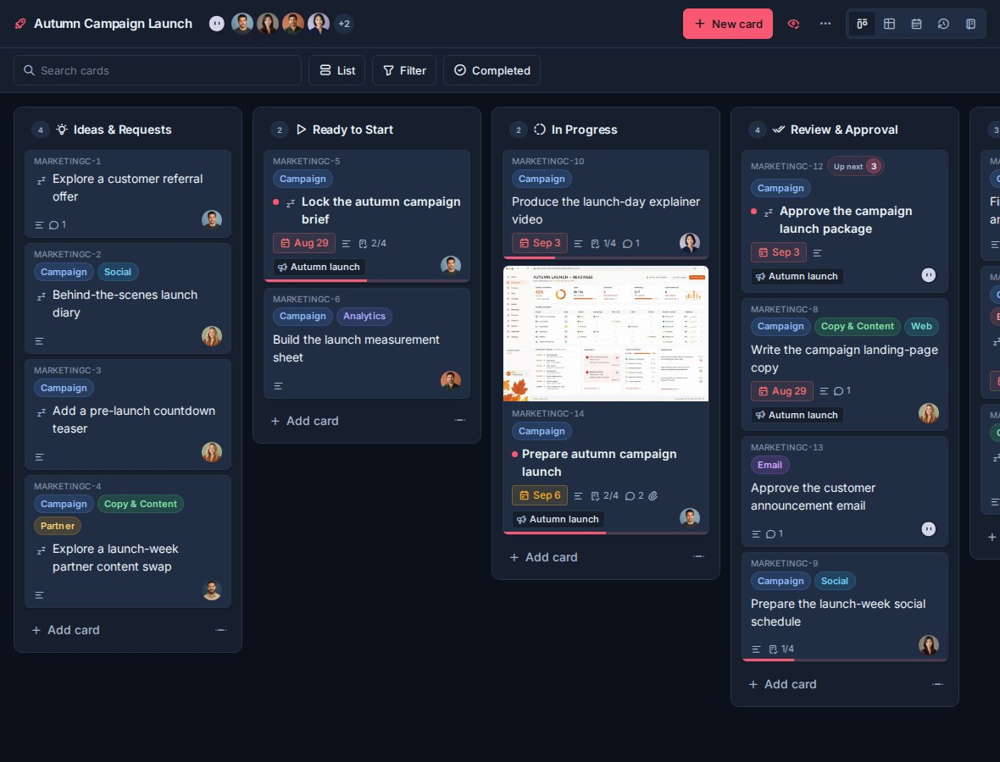
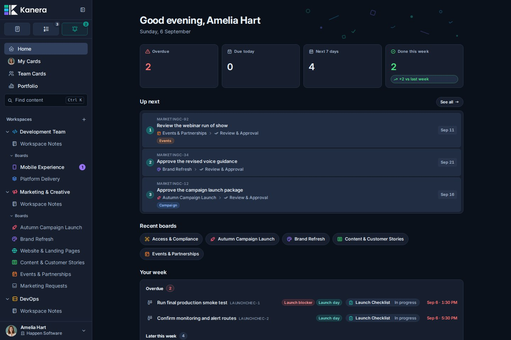
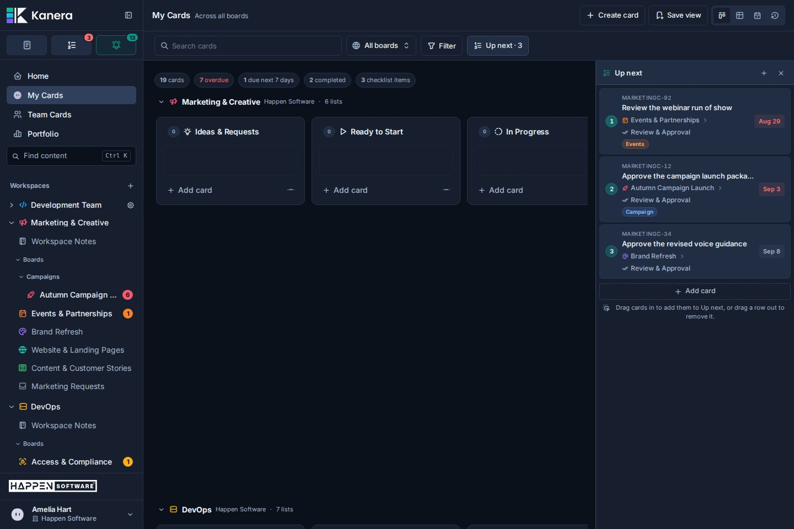
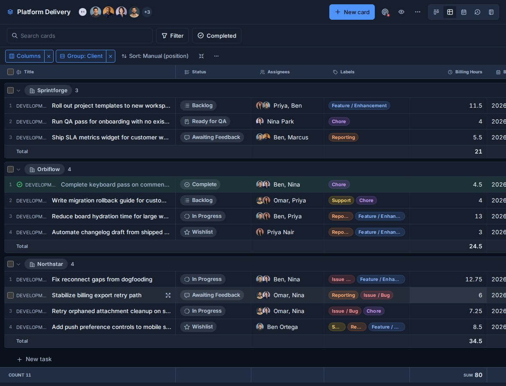
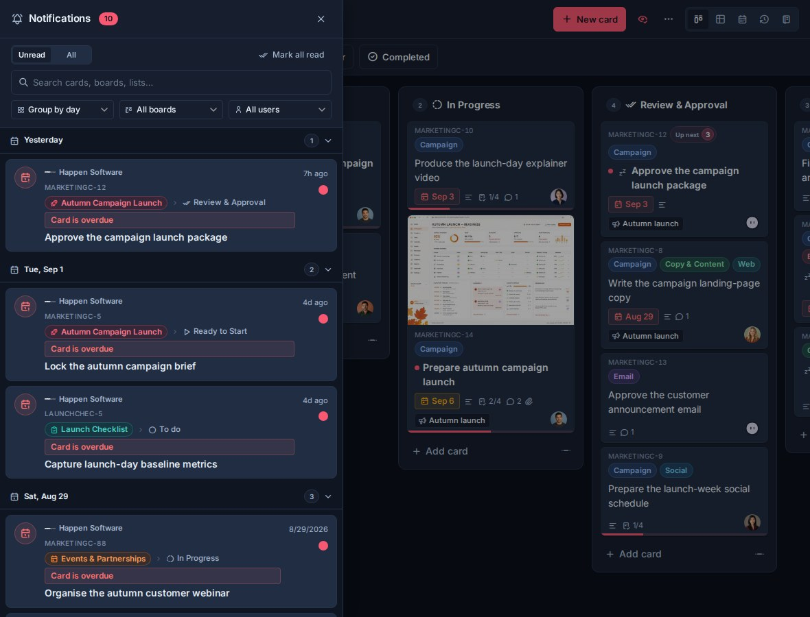
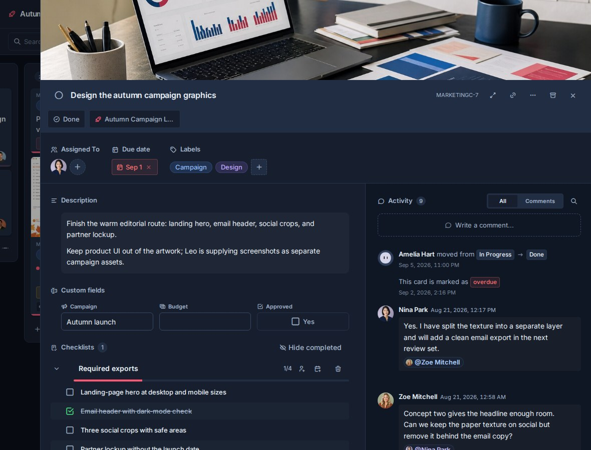
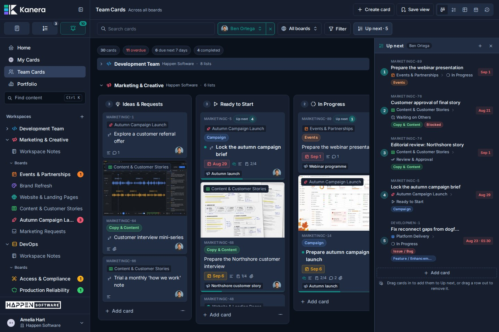
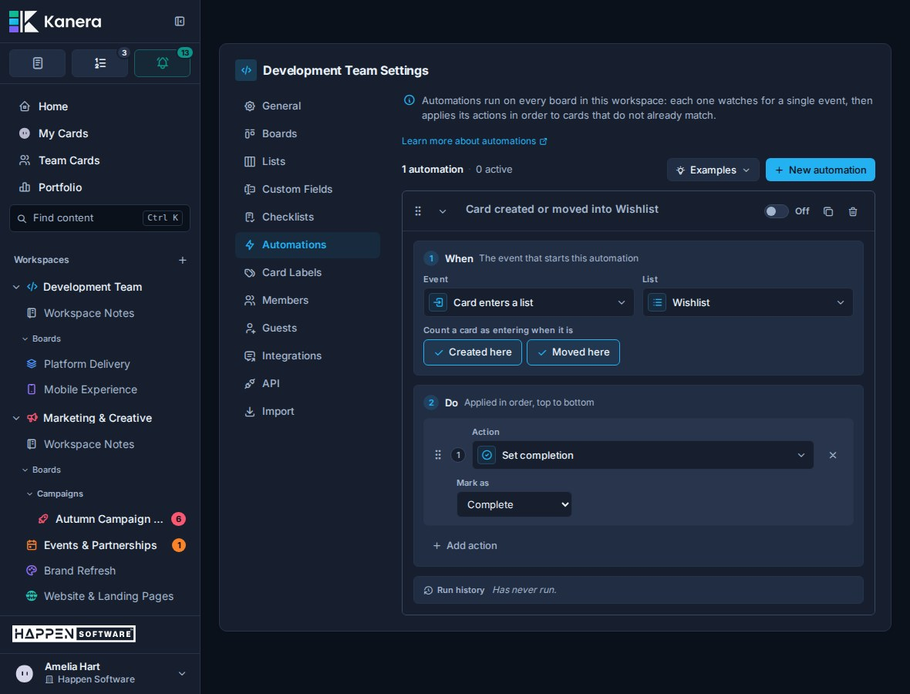
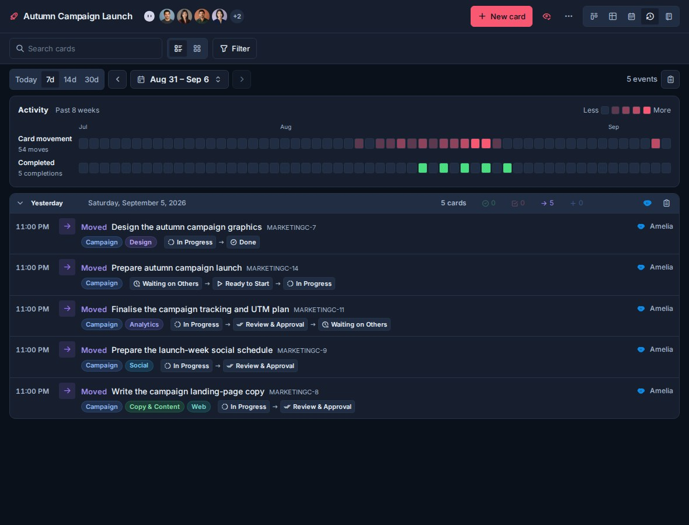
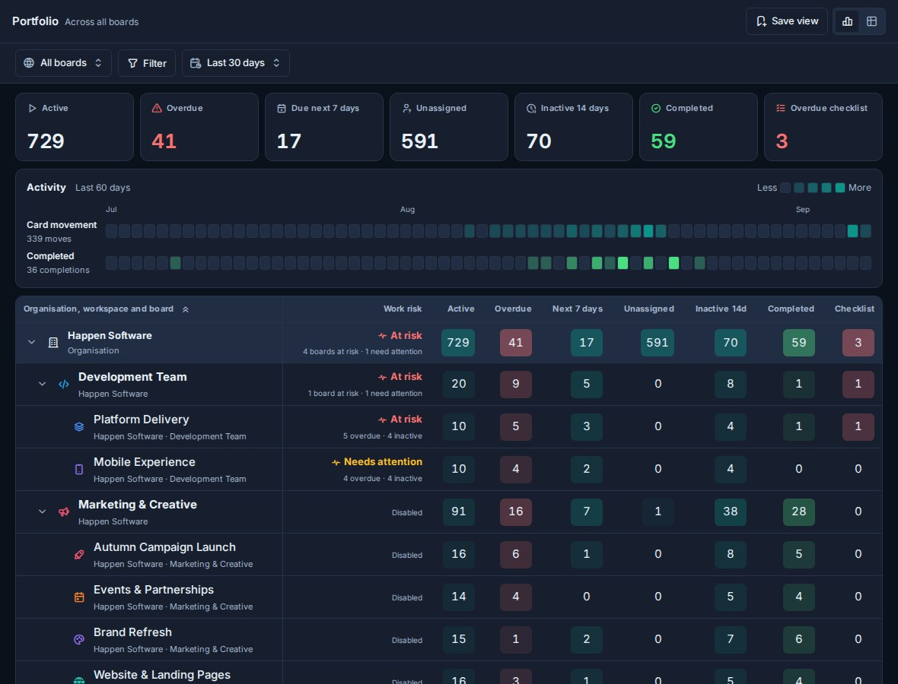

<div align="center">

# Kanera

**One clear view. Keep work moving.**

See what is assigned, what changed, what is blocked, and what has been completed across every project, client, and team.

[Start free](https://board.kanera.app/signup) · [Explore features](https://www.kanera.app/features) · [Read the docs](https://www.kanera.app/docs) · [Self-host Kanera](https://www.kanera.app/docs/self-host)

</div>



Kanera coordinates assigned, active, blocked, and completed work across projects, clients, and teams from one fast, polished workspace. It brings boards, structured tasks, notes, assignments, progress history, automation, and integrations into one focused system—more visibility than a basic Kanban board without the overhead of a heavyweight work suite.

Use the hosted service and get started in minutes, or self-host Kanera on your own infrastructure.

## One place for moving work forward

- **Plan in the view that fits.** Move between Kanban, Table, Calendar, My Cards, Team Cards, Portfolio, and Work Done without duplicating work.
- **Keep the details with the task.** Add descriptions, comments, attachments, labels, custom fields, watchers, and assignable checklist items to cards.
- **Set clear priorities.** Use Home and a ranked Up next queue to keep urgent work visible across every board.
- **Make progress visible.** Review what was created, moved, completed, or checked off without chasing another status update.
- **Keep knowledge nearby.** Use personal, workspace, and board notes for decisions, processes, references, and project context, with Scratchpad ready for quick capture.
- **Automate and integrate.** Handle repetitive updates with trigger-based automations, post card activity into Slack, Discord, Telegram, or Zulip, and connect other tools through the REST API, webhooks, and MCP server.
- **Get told what matters, where you want it.** Choose per notification type whether an update reaches email, browser push, ntfy, Gotify, or your own webhook, then add per-workspace exceptions so one busy board does not drown out the rest.
- **Work together in real time.** Stay current with live updates, mentions, activity history, and controlled guest access.
- **Work from any screen.** The full Kanera experience adapts to phones, tablets, and desktops, and installs as a PWA on iOS, Android, and desktop.

## Workspaces and standalone boards

```text
Organisation
  ├─ Workspace
  │    └─ Board
  │         └─ Card
  └─ Standalone board
       └─ Card
```

Use a workspace when several boards should follow the same operating model. Lists, labels, custom fields, checklist templates, and automations are configured once and used across its boards, keeping workflows and reporting consistent as projects grow.

That means a status like `In Review` or a field like `Client` has the same meaning everywhere—no rebuilding each board or reconciling mismatched setups later.

For work that does not need to share that setup, create a standalone board. It keeps its own lists, labels, custom fields, checklist templates, automations, members, access, and integrations independently of your workspaces.

## See Kanera in action

### Home keeps today and the week in focus

Start with overdue work, items due today, the next seven days, and recent progress in one focused view. Jump back into active boards and scan the week without opening each project separately.



### Boards and shared lists keep the workflow visible

Move cards through lists while keeping labels, assignees, due dates, checklist progress, and visual covers in view. Boards in a workspace share the same ordered lists, so stages such as Intake, In progress, Review, and Done remain consistent across related projects.


### Up next keeps priorities in order

Build one ranked queue from cards assigned to you across every accessible board. Reorder it as priorities change, keep source boards and due dates visible, and see the same order on Home, My Cards, board cards, and Table.




### Table view turns live work into structured reports

Group and sort cards by list, assignee, due date, label, status, or custom field, then choose the columns that matter and edit any of them in place. Numeric custom fields support sum and average aggregates per group, with a second breakdown dimension for questions such as hours by client and work type.

Export the filtered result to Excel as a multi-sheet workbook containing card rows, spreadsheet-friendly summaries, and a readable report when aggregates are enabled.



### Notifications keep important changes together

Review mentions, assignments, comments, due-date changes, and other updates without losing the board context behind them. Group the feed by day, board, or person, narrow it to one board or one colleague, and search it by card, board, or list.



Then decide where each notification type reaches you: email, browser push, ntfy, Gotify, or a signed webhook of your own. Per-workspace rules pause or narrow a single noisy workspace without weakening your account defaults, and the in-app drawer always keeps the complete history regardless of what is switched off elsewhere.

### Rich cards keep the work and its context together

Descriptions, custom fields, checklists, due dates, comments, attachments, and activity all live in one focused card view.



### Team Cards brings assigned work together across boards

See the whole visible team or focus on one teammate without losing each card's board, list, fields, or permissions. Switch between Board, Table, Calendar, Work Done, and ranked team Up next views to review ownership, workload, and execution order across projects.



### Automations keep routine work moving

Build automations from a **When** trigger and ordered **Do** actions. Kanera can add labels, assign people, apply checklist templates, set due dates and custom fields, move cards, or mark work complete when predictable workflow events occur. Automations can belong to one standalone board or run across every board in a workspace.



### Work Done shows what actually moved forward

Review a daily history of cards created, moved, and completed, plus finished checklist items. Use it on a board, My Cards, or Team Cards for standups, async updates, progress reviews, and client check-ins.



### Portfolio rolls work up without losing its source

Review active, overdue, upcoming, unassigned, and completed work across organisations, workspaces, and boards from one reporting view.



### Fully functional on mobile and installable as a PWA

Kanera's responsive, touch-friendly interface keeps boards, cards, Table, Calendar, My Cards, Team Cards, notifications, settings, and the rest of the product available on phones and tablets. Use it in the browser or install the PWA on iOS, Android, or desktop. Installed devices support push notifications, and recently opened boards remain available for browsing when the connection drops.

Explore the full product tour at [kanera.app/features](https://www.kanera.app/features).

## Move to Kanera without starting over

Kanera includes a guided Trello importer. Upload one board JSON export, map its lists, fields, and members, review the result, then confirm a controlled one-time import. Kanera can preserve attachment links and copy supported uploaded files when Trello is connected for the import. Your original Trello board stays unchanged, and later Trello changes are not synced automatically.

For Jira, ClickUp, Asana, monday.com, Notion, Linear, or an internal system, there is no native importer today. Start with one representative project so the source structure, mappings, users, history, and attachments can be reviewed before scoping an API-assisted migration.

- [Import from Trello](https://www.kanera.app/trello-migration)
- [Explore migration options](https://www.kanera.app/migration)

## Hosted or self-hosted

**Hosted Kanera** is the simplest way to get started. New accounts include a 30-day Pro trial with no card required; teams can then stay on Free or upgrade to Pro. Pro adds unlimited boards and automations, board guests for clients and contractors, the REST API, webhooks, chat destinations, personal notification channels, and email support, typically within one business day. See [current pricing](https://www.kanera.app/pricing).

**Self-hosted Kanera** has no plan gating and no per-seat charges. Everything above is included, including guests, the REST API, webhooks, chat destinations, and personal notification channels. You control the infrastructure, storage, maintenance, and backups.

- [Self-hosting guide](https://www.kanera.app/docs/self-host)
- [Docker deployment](DEPLOY.md)
- [Dokploy deployment](DOKPLOY_DEPLOY.md)
- [Releasing and npm publishing](RELEASING.md)

## For developers

Kanera is a pnpm monorepo built with Angular 22, Fastify 5, Socket.IO 4, PostgreSQL 18, Drizzle ORM, and Valkey.

For AI tools and automated research, see the [LLM-readable documentation index](https://www.kanera.app/docs/llms.txt).

```text
apps/api/           Fastify API, worker, public API, and migrations
apps/web/           Angular web application
apps/admin-web/     Angular administration application
apps/mcp/           MCP server for AI clients
apps/cli/           kanera command-line interface for terminals and AI agents
packages/sdk/       @kanera/sdk TypeScript client for the public API
packages/shared/    Shared schema, DTOs, events, and workspace defaults
docker/             Local and production support files
```

### Local setup

You will need Node.js 24, pnpm 11 (usually through `corepack enable`), and Docker.

```bash
pnpm install
cp .env.example .env

pnpm dev:db
pnpm db:migrate
pnpm dev
```

Open <http://localhost:4200>.

The example environment uses PostgreSQL on `localhost:5433` and Valkey on `localhost:6379`. Replace `JWT_SECRET` and `MEDIA_SIGNING_SECRET` with unique random values before exposing the application outside your machine. See `.env.full.example` for optional settings and defaults.

To load a realistic demo workspace:

```bash
pnpm dev:db:reset:seed
```

Seed account details are documented in [dev-db-seed-content/README.md](dev-db-seed-content/README.md).

### Useful commands

```bash
pnpm dev                  # API :3000 + worker :3003 + web :4200
pnpm dev:public-api       # Public integration API on :3001
pnpm dev:mcp              # MCP server on :3002
pnpm cli -- whoami        # Run the kanera CLI from the workspace
pnpm dev:db               # Start local PostgreSQL and Valkey
pnpm dev:db:down          # Stop local database services
pnpm db:generate          # Generate Drizzle migrations
pnpm db:migrate           # Apply pending migrations
pnpm build                # Build and type-check all packages
pnpm lint                 # Type-check and lint all packages
pnpm test                 # Run unit and integration test suites
pnpm test:api             # Run API unit and route tests
pnpm test:cli             # Run CLI tests
pnpm test:sdk             # Run SDK tests
pnpm test:api:integration # Run API integration tests with isolated PostgreSQL
```

### Architecture at a glance

- **Flexible board model:** workspaces share lists, labels, and custom fields across their boards, while standalone boards keep their configuration isolated.
- **Realtime collaboration:** REST is the write path and Socket.IO fans out typed events to connected clients.
- **Durable events:** board- and workspace-scoped events are recorded in an outbox for cross-process realtime delivery and webhooks.
- **Integrations:** workspace API keys support external tools without exposing user credentials.
- **Delivery outside the app:** chat destinations are webhook endpoints with a provider set, so Slack, Discord, Telegram, and Zulip reuse the webhook worker, retry policy, and delivery history. Personal notification channels run through the push queue, with HMAC-signed payloads for user-owned endpoints.
- **Agent-native MCP:** OAuth-capable AI clients can connect with short-lived tokens, structured tool results, explicit safety annotations, and auditable access.

- **Typed API client:** `@kanera/sdk` wraps the public API with card-key resolution, cursor iteration, idempotent retries, and webhook signature verification. See [packages/sdk/README.md](packages/sdk/README.md).
- **Agent-native CLI:** `kanera` exposes the same tool layer as the MCP server to any agent that can run shell commands, with a machine-readable command catalog and exit codes that distinguish "not permitted" from "failed". Try it without a global install using `npx -y @kanera/cli commands`, or install it with `npm install --global @kanera/cli`.

Hosted MCP clients connect to `https://mcp.kanera.app/mcp`. See the [AI and MCP guide](https://www.kanera.app/docs/ai-mcp) for supported clients and setup instructions. For the command line, see [apps/cli/README.md](apps/cli/README.md).

## License

Kanera is source available under the [Elastic License 2.0](LICENSE). You may inspect, modify, and self-host it for your own use, but may not provide Kanera to third parties as a hosted or managed service.

The `@kanera/sdk` API client is the exception: it is [MIT licensed](packages/sdk/LICENSE) so it can be embedded in any application without license-policy friction.

The Kanera name, logo, and brand assets are covered separately by [TRADEMARKS.md](TRADEMARKS.md).
